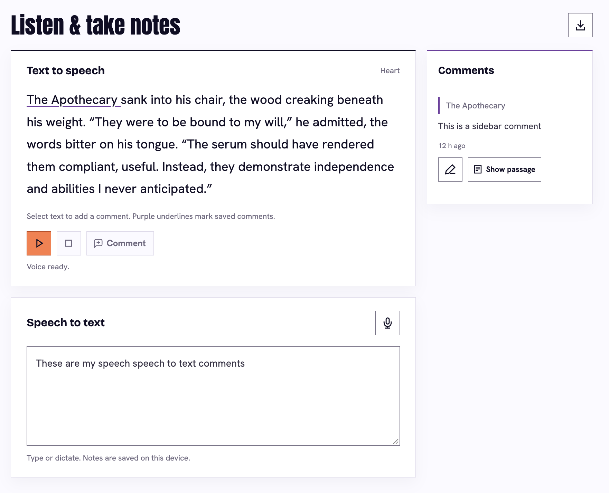
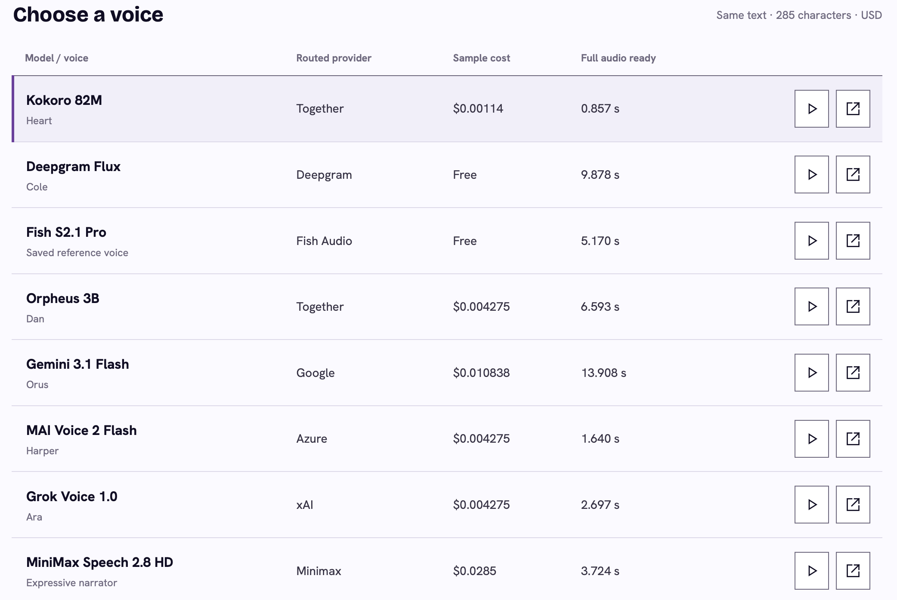

# Listen & take notes

A small, local web demo for listening to prose, dictating notes, and attaching comments to selected text. The main app uses **Kokoro WebGPU with the Heart voice**. A separate [model-research page](research/README.md) compares eight recorded OpenRouter samples with word highlighting and measured costs.

**On this page:** [Run the demo](#run-the-main-demo) · [Interactions](#try-the-interactions) · [Model research](#open-the-model-research) · [Development](#development)

## Run the main demo

<details>
<summary>Preview the main demo</summary>

<a href="assets/images/demo.png"></a>

[View full-size screenshot](assets/images/demo.png)

</details>

Use Node.js 22 or newer and a recent desktop Chrome with hardware acceleration enabled. From the project root:

```sh
npm ci
npm run setup:model
npm run build
npm test
npm start
```

Open **http://127.0.0.1:4182**. The server binds to your own computer. If that port is occupied, use an available port appropriate for your machine:

```sh
npm start -- --port 4183
```

On later visits, run `npm start`. Press Ctrl+C to stop the server. Keep using the same hostname and port to return to the same browser-saved notes. Double-clicking the main `index.html` does not work.

Setup downloads roughly 326 MB of pinned model/voice assets and creates model cache parts. Allow about 2 GB for dependencies, model files, and caches. Runtime synthesis is local; no API key or paid service is required. Rebuild after source changes to refresh the browser worker and service-worker cache identity.

## Try the interactions

- **Listen:** the voice and first sentence prepare when the page opens. Play, pause/resume, or stop. The current sentence highlights and the status shows progress. Starting playback before preparation finishes can still involve a wait.
- **Take notes:** type in the bottom pane or use Dictate. Finalized speech appends to existing notes; interim words stay separate.
- **Comment:** select text and use Comment. Partial-word selections expand to whole words. Type or dictate, review, and Save. Saved comments underline their source in purple and show a saved/edited timestamp.
- **Edit:** open a comment with its pencil. Back retains an unfinished draft; Save updates the original comment. Delete requires confirmation.
- **Export:** the top download button exports one JSON sidecar with all saved selection comments and the current general notes. Unfinished drafts and interim dictation are excluded. The passage is never modified.

Familiar actions use icons with hover/focus tooltips; Comment, Save, Back, Show passage, and Resume also have visible labels. Tab moves between controls; Escape dismisses tooltips.

Dictation requests Chrome's on-device English recognition. It may need a language-pack download and microphone permission. Unsupported browsers keep typing available; there is no cloud fallback. Starting playback cancels dictation, and starting dictation stops playback.

Notes and comments stay in browser storage on this device. Export important work before clearing browser data or changing computers. Another hostname, port, browser, or profile uses different storage. The export includes the demo passage as well as your notes and comments.

## Open the model research

<details>
<summary>Preview the model research</summary>

<a href="assets/images/research.png"></a>

[View full-size screenshot](assets/images/research.png)

</details>

Open `research/index.html` directly, or run its independent static server:

```sh
node research/serve.mjs
```

Open the address printed in the terminal. This server chooses a free loopback port and supports audio seeking. The research page bundles eight recordings, timing sidecars, public request/billing extracts, and local fonts. Playback makes no API calls. Its approximate word alignment is distinct from the main app's sentence highlighting.

The [research README](research/README.md) explains the comparison and controls. Historical prices and response times are observations from one round, not current price promises or a performance benchmark.

## Development

`npm test` runs 30 deterministic reader, dictation, and comment tests using public synthetic fixtures. `npm run build` bundles the worker/runtime and updates the offline shell identity. `python3 research/tools/verify.py` checks research audio/request hashes, metadata, and timing coverage without network access.

See [AGENTS.md](AGENTS.md) for implementation contracts and [THIRD_PARTY_NOTICES.md](THIRD_PARTY_NOTICES.md) for bundled fonts and downloaded components.

The repository contains app source, tests, setup/build scripts, and the curated research example. Installed dependencies, generated models/runtime files, browser state, raw experiments, maintainer evidence, archives, and packaged release copies are intentionally ignored. A fresh checkout does not depend on those local files.
